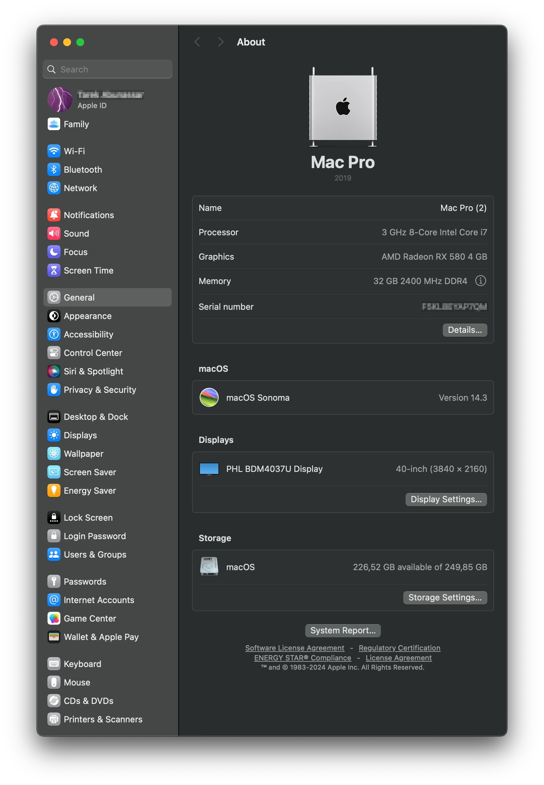
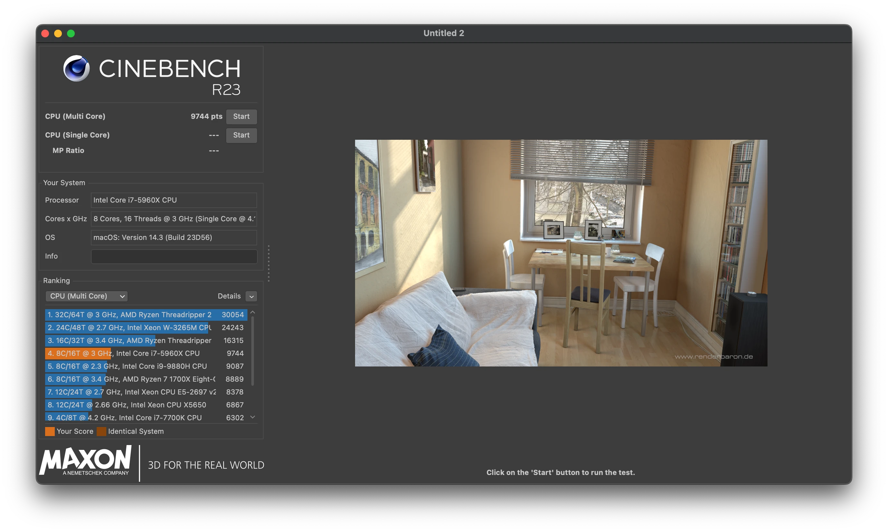
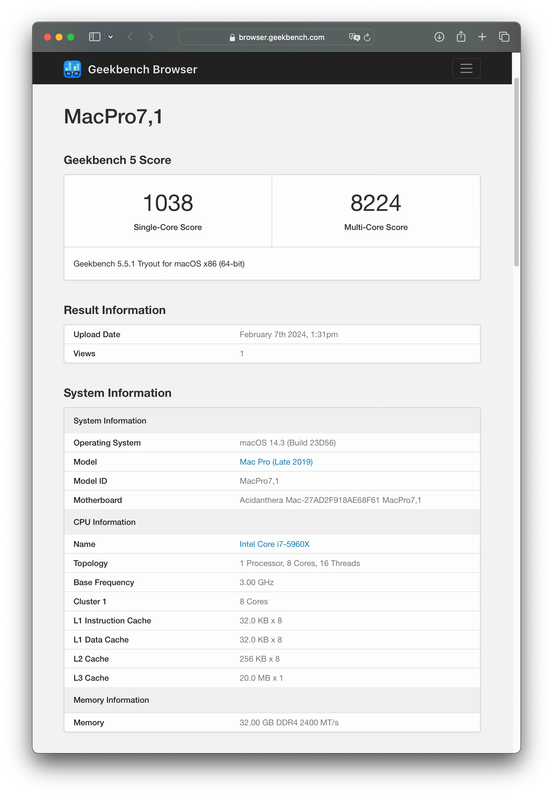
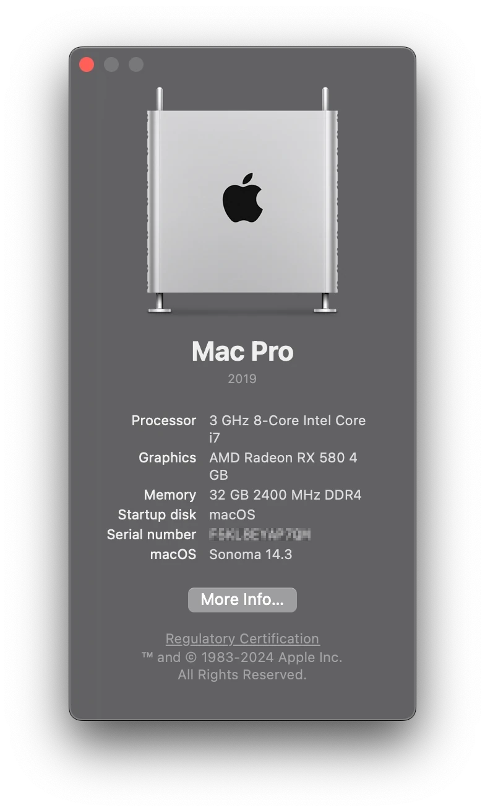

# Asus x99 Deluxe
**([english version](https://github.com/tarkh/hackintosh/tree/main/Asus-x99-Deluxe))**

##  `Версия для macOS 14 (Sonoma)`
<p align="center">
  
</p>

##
* [Вводная информация](#intro)
* [Настройка BIOS](#biosSetup)
* [Запуск macOS](#runMac)
* [Nvidia Kepler](#nvidiaKepler)
* [AMD Radeon](#amdRadeon)
* [WiFi и Bluetooth](#wifiAndBluetooth)
* [Убираем из системы USB-накопитель](#removeUsb)
* [Бенчмарки в macOS](#benchmarks)
* [Эпилог](#end)

<a name="intro"></a>
## Вводная информация

В данном репозитории представлена информация по установке **macOS** на систему со следующими техническими характеристиками:

* Материнская плата: `Asus x99 Deluxe`
* Процессор: `i7-5960X`

В качестве EFI-загрузчика будет использоваться **OpenCore**, поэтому перед началом работы крайне рекомендуется ознакомиться с данным загрузчиком и его функционалом [тут (OpenCore Guide)](https://dortania.github.io/OpenCore-Install-Guide/).

<a name="biosSetup"></a>
## Настройка BIOS

Версия биоса: `3802`

Основные настройки:
```
Enhanced Intel SpeedStep Technology [Enabled]
Turbo Mode [Enabled]
Hyper-Threading [ALL] [Enabled]
Limit CPUID Maximum [Disabled]
Execute Disable Bit [Enabled]
Intel Virtualization Technology [Enabled]
Hardware Prefetcher [Enabled]
Boot Performance Mode [Max Performance]
CPU C-States [Auto]
SATA Controller 2 Mode Selection [AHCI]
Intel VT for Directed I/O (VT-d) [Enabled]
Intel xHCI Mode [Enabled]
EHCI Legacy Support [Auto]
xHCI Hand-off [Enabled]
EHCI Hand-off [Enabled]
HD Audio Controller [Enabled]
Asmedia USB 3.0 Controller [Enabled]
Bluetooth Controller [Enabled]
Wi-Fi Controller [Enabled]
Intel LAN1 Controller [Enabled]
Intel LAN2 Controller [Enabled]
Fast Boot [Enabled]
SATA Support [All Devices]
USB Support [Full Initialization]
Boot up NumLock State [Enabled]
Above 4G Decoding [Enabled]
Launch CSM [Disabled]
OS Type [Other OS]
```

<a name="runMac"></a>
## Запуск macOS

Для запуска macOS нам понадобится директория `./EFI`, которую необходимо целиком скопировать в корень USB-накопителя, предварительно отформатировав его в **fat32**. Обратите внимание, что директория `./EFI` содержит `production` версию загрузчика.

> Если у вас нет установленной ранее macOS на внутреннем диске, тогда вам нужно создать установочный флеш-накопитель по [официальной инструкции OpenCore](https://dortania.github.io/OpenCore-Install-Guide/installer-guide/). Когда вы запишите установочный флеш-накопитель, скопируйте в корень смонтированного EFI-раздела директорию `./EFI` из данного репозитория.

Директория EFI содержит преднастроенный для данной конкретной системы загрузчик OpenCore. Пропатчены и скомпилированы все необходимые ACPI таблицы, добавлены нужные kext'ы, поддержка 24 ядер и 48 потоков, настроен `EFI/OC/config.plist`.

Тем не менее, перед запуском необходимо внести некоторые обязательные изменения в директорию EFI и `EFI/OC/config.plist`. Во избежании непредвиденных ошибок файлы типа `*.plist` открывайте в специализированном plist-редакторе! Итак, что нужно сделать:

* Сгенерировать и добавить свои уникальные серийные номера для модели **MacPro7,1**. Вам понадобится утилита [GenSMBIOS](https://github.com/corpnewt/GenSMBIOS). Полученные UUID и серийники нужно заменить в файле `EFI/OC/config.plist` в следующих ключах:
* `PlatformInfo > Generic > MLB` ставим сгенерированное значение `Board Serial`.
* `PlatformInfo > Generic > SystemSerialNumber` ставим сгенерированное значение `Serial`.
* `PlatformInfo > Generic > SystemUUID` ставим сгенерированное значение `SmUUID`.
* `PlatformInfo > Generic > ROM` ставим сгенерированное значение `Rom`.
* USB-порты настроены под конкретную модель материнской платы, настройки находятся в `EFI/OC/Kexts/USBPorts.kext/Contents/info.plist`. Детальная инструкция по конфигурированию USB-портов [находится тут](https://dortania.github.io/OpenCore-Post-Install/usb/system-preparation.html).

Сохраните файл конфигурации, перезагрузите компьютер, зайдите в BIOS и выберите загрузку с UEFI-раздела вашего флеш-накопителя. Если все было сделано правильно, вы увидите загрузочное меню OpenCore, где сможете выбрать внутренний накопитель с уже установленной macOS или установщик macOS в случае свежей установки.

<a name="nvidiaKepler"></a>
## Nvidia Kepler
Начиная с macOS Monterey Apple удалила драйверы для видеокарт Nvidia Kepler из системы. Тем не менее, есть возможность вернуть поддержку данных видеокарт используя [OpenCore Legacy Patcher](https://dortania.github.io/OpenCore-Legacy-Patcher/). Ознакомьтесь с инструкцией по установке и некоторыми ограничениями, которые накладывает данная модификация.

И замените ключи загрузки в NVRAM:

* `NVRAM > Add > 7C436110-AB2A-4BBB-A880-FE41995C9F82` закомментируйте (переименуйте) ключ `boot-args` в `#boot-args`.
* `NVRAM > Add > 7C436110-AB2A-4BBB-A880-FE41995C9F82` разкомментируйте (переименуйте) ключ `#NVIDIA_KEPLER#boot-args` в `boot-args`.

<a name="amdRadeon"></a>
## AMD Radeon
Для правильной работы AMD сенсоров включите 2 kext-файла `RadeonSensor.kext` и `SMCRadeonGPU.kext` в `EFI/OC/config.plist` в следующих ключах:

* `Kernel > Add > 20 > Enabled` ставим в `True`.
* `Kernel > Add > 21 > Enabled` ставим в `True`.

В некоторых случаях для поколения `Navi` может понадобится загрузочный параметр `agdpmod=pikera`. Подробнее об `NVRAM` параметрах можете прочитать в [официальной документации Opencore](https://dortania.github.io/OpenCore-Install-Guide/AMD/zen.html#nvram). Поддержку других поколений видеокарт AMD вы можете попробовать пропатчить с помощью [OpenCore Legacy Patcher](https://dortania.github.io/OpenCore-Legacy-Patcher/). 500-ая серия видеокарт от `AMD` (rx560, rx580...) должна работать без дополнительных манипуляций.

<a name="wifiAndBluetooth"></a>
## WiFi и Bluetooth

На материнской плате присутствует модуль с чипом Broadcom, поддержка которого прекратилась в текущей версии macOS. Для его функционирования, после установки системы macOS её необходимо пропатчить с помощью [OpenCore Legacy Patcher](https://dortania.github.io/OpenCore-Legacy-Patcher/). После патча, не перезагружаясь, нужно включить в `EFI/OC/config.plist` kext-файлы `IOSkywalkFamily.kext`, `IO80211FamilyLegacy.kext` и `IO80211FamilyLegacy.kext/Contents/PlugIns/AirPortBrcmNIC.kext`:

* `Kernel > Add > 13 > Enabled` ставим в `True`.
* `Kernel > Add > 14 > Enabled` ставим в `True`.
* `Kernel > Add > 15 > Enabled` ставим в `True`.

Также необходимо заблокировать системный драйвер `com.apple.iokit.IOSkywalkFamily`:

* `Kernel > Block > 0 > Enabled` ставим в `True`.

После этого нужно перезагрузить систему и `WiFi + Bluetooth` должны заработать вместе с беспроводными функциями Apple.

<a name="removeUsb"></a>
## Убираем из системы USB-накопитель

После того, как идеальный efi-драйвер найден и вы **преисполнились какнада**, мы готовы к консервации загрузчика, чтобы избавиться от необходимости иметь загрузочную флешку в USB-разъеме компьютера. Для этого нам необходимо смонтировать EFI-раздел на внутреннем диске и перенести в его корень директорию EFI из корня нашего USB-накопителя. Если мы используем macOS, желательно смонтировать EFI-раздел на том же самом носителе, где расположена ОС. Это верно и для любых других операционных систем. В мульте-бут достаточно расположить OpenCore на какой-то один из носителей. Главное не забыть назначить этот носитель первым в очереди на загрузку в биосе.

Как монтировать EFI-разделы в разных операционных системах можно найти в `Google/Yandex`.

<a name="benchmarks"></a>
## Бенчмарки в macOS

<table width="100%">
  <tr>
    <td align="center" valign="top" colspan="2">
      Cinebench R23<br>
      
    </td>
  </tr>
  <tr>
    <td align="center" valign="top">
      Geekbench 5<br>
      
    </td>
  </tr>
</table>

<a name="end"></a>
## Эпилог

Все основные функции, такие как Управление питанием процессора, USB порты, WiFi+Bluetooth и Сон работают исправно. Беспроводные функции Handoff и AirDrop также функционируют. Сама операционная система работает быстро и гладко.

Буду рад фидбэку с целью улучшить данную конфигурацию. Меня можно найти в telegram:
* [@tarkhx](https://t.me/tarkhx)

<p>&nbsp;</p>
<p>&nbsp;</p>
<p>&nbsp;</p>
<p align="center">
  
</p>
