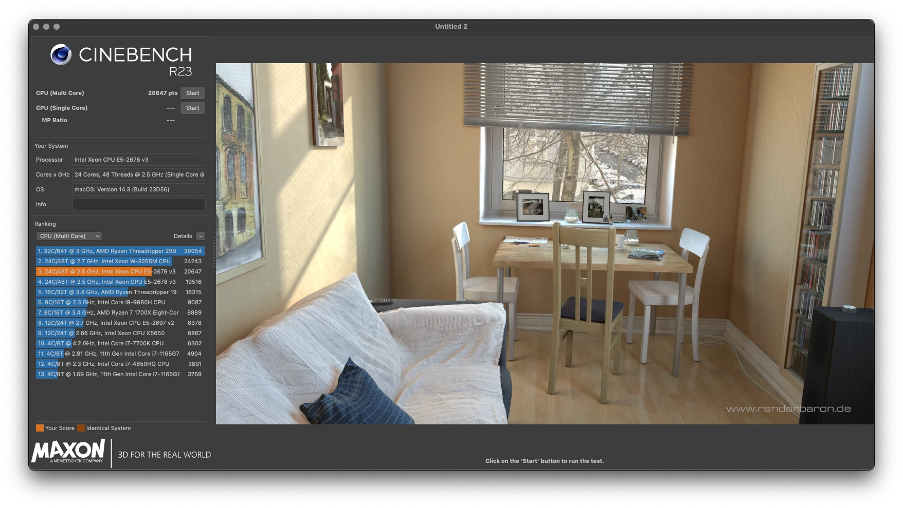
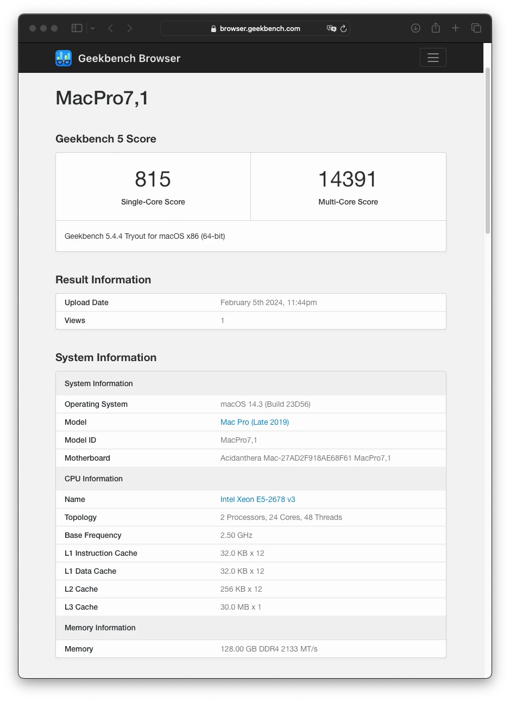
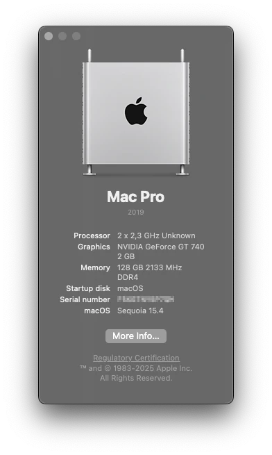

# Huananzhi F8D
**([English version](https://github.com/tarkh/hackintosh/blob/main/Huananzhi-F8D/README.md))**

##  `Версия для macOS 15 (Sequoia)`

  

*Эта версия должна работать с операционными системами macOS, начиная с **10.14 (Mojave)** и заканчивая **macOS 15 (Sequoia)**, однако, если у вас возникли проблемы с запуском **macOS < версии 15**, вы можете попробовать более раннюю сборку из соответствующей ветки `macOS 10.14 (Mojave)`, `macOS 11 (Big Sur)`, `macOS 12 (Monterey)` или `macOS 14 (Sonoma)` в этом репозитории.*

##
* [Введение](#intro)
* [Настройка BIOS](#biosSetup)
* [Запуск macOS](#runMac)
* [Nvidia Kepler](#nvidiaKepler)
* [AMD Radeon](#amdRadeon)
* [Fenvi T919 WiFi+BT](#fenviT919)
* [Прошивка BIOS](#wbios)
* [Андервольтинг](#undervolting)
* [Для пользователей Windows](#windows)
* [Для пользователей Linux](#linux)
* [Удаление USB-накопителя из системы](#removeUsb)
* [Я профи, мне не нужно читать много букв](#imPro)
* [Тесты производительности в macOS](#benchmarks)
* [Эпилог](#end)

## Введение

Этот репозиторий содержит информацию по установке **macOS** на систему со следующими техническими характеристиками:

* Материнская плата: Huananzhi F8D
* Процессор: x2 E5-2698V3

В качестве загрузчика EFI будет использоваться **OpenCore (1.0.1)**, поэтому перед началом процесса настоятельно рекомендуется ознакомиться с этим загрузчиком и его функциональностью [здесь (руководство OpenCore)](https://dortania.github.io/OpenCore-Install-Guide/). Помимо базовой настройки OpenCore, будет описан метод разблокировки турбо-режима на всех ядрах процессора и его андервольтинга.

**Совет по настройке процессора**: Xeon E5-2698V3 был выбран, потому что он имеет 16 ядер и 32 потока, следовательно, с двумя процессорами в системе будет 32 ядра и 64 потока. Имейте в виду, что **ядро macOS не поддерживает конфигурации процессоров с более чем 64 потоками**, поэтому если у вас большее количество ядер, отключите некоторые из них в BIOS, чтобы уложиться в лимит 64 потоков!

**Совет по настройке памяти системы**: эта материнская плата поддерживает **8-канальную** память DDR4 (x2 процессора с 4 каналами на каждый), поэтому если использовать все 8 слотов памяти, это даст прирост производительности **до 15%** по сравнению с использованием только 4 слотов (2 на каждый процессор).

## Настройка BIOS

Если вы не собираетесь прошивать BIOS из этого репозитория, то вам нужно внести определенные изменения в настройки стандартного BIOS. Модифицированный BIOS из этого репозитория уже содержит все необходимые настройки по умолчанию для правильного запуска macOS.

Для начала зайдите в BIOS, сбросьте все настройки на значения по умолчанию и сохраните с перезагрузкой, затем измените следующие параметры:

* `Advanced > Trusted Computing > Security Device Support` **Disabled**
* `Advanced > ACPI Settings > Enable ACPI Auto Configuration` **Enabled**
* `Advanced > NCT5532D SSIO Configuration > Serial Port 1 Configuration > Serial Port` **Disabled**
* `Advanced > Smart Fan function setting` следует настроить в зависимости от вашей системы охлаждения и процессоров. В моем случае, с башнями A500 на обоих процессорах, параметры настроены следующим образом (тихо и температура под полной нагрузкой не превышает 65 градусов):
* `Smart Fan Temperature 1` **30**
* `Smart Fan Temperature 2` **42**
* `Smart Fan Temperature 3` **55**
* `Smart Fan Temperature 4` **67**
* `Smart Fan Critical Temperature` **67**
* `Smart Fan PWM 1` **25**
* `Smart Fan PWM 2` **51**
* `Smart Fan PWM 3` **127**
* `Smart Fan PWM 4` **255**
* `Advanced > Serial Port Console Redirection > Console Redirection` **Disabled**
* `Advanced > PCI Subsystem Settings > Above 4G Decoding` **Enabled**
* `Advanced > Network Stack Configuration > LAN Wake up Control` **Disabled**
* `Advanced > CSM Configuration > CSM Support` **Disabled**. Чтобы отключить эту опцию, сначала нужно переключить видео из режима `Legacy` в режим `UEFI`, сохранить настройки BIOS и перезагрузиться. Только после этого можно будет установить `CSM Support` в положение **Disabled**. При этом, в зависимости от видеокарты, при установке параметра Video из режима `Legacy` в режим `UEFI`, необходимо установить параметр `Advanced > PCI Subsystem Settings > Above 4G Decoding` в положение **Enabled**, иначе после перезагрузки видео может пропасть и придется сбрасывать BIOS, снимая батарею.
* `Advanced > USB Configuration > EHCI Hand-Off` **Enabled**
* `IntelRCSetup > Processor Configuration > MSR Lock Control` **Disable**
* `IntelRCSetup > Advanced Power Management Configuration > CPU C State Control > Package C State limit` **C2 state**
* `IntelRCSetup > Advanced Power Management Configuration > CPU C State Control > CPU C3 report` **Enable**
* `IntelRCSetup > Advanced Power Management Configuration > CPU C State Control > CPU C6 report` **Disable**
* `Security > Secure Boot menu > Secure Boot` **Disabled**

## Запуск macOS

Чтобы запустить macOS, нам нужна директория `./EFI`, которую необходимо скопировать в корень USB-накопителя, предварительно отформатировав его в **fat32**. Обратите внимание, что директория `./EFI` содержит **production** версию загрузчика.

> Если у вас не установлена macOS на внутреннем диске, то необходимо создать установочную флешку согласно [официальной инструкции OpenCore](https://dortania.github.io/OpenCore-Install-Guide/installer-guide/). Когда установочная флешка будет записана, скопируйте директорию `./EFI` из этого репозитория в корень смонтированного раздела EFI на USB устройстве.

Директория EFI содержит загрузчик OpenCore, предварительно настроенный для этой системы: патчи и компиляции всех необходимых таблиц ACPI, добавлены необходимые kexts, настроен `EFI/OC/config.plist`.

Тем не менее, перед запуском необходимо внести несколько обязательных изменений в директорию EFI и файл `EFI/OC/config.plist`. Чтобы избежать неожиданных ошибок, открывайте файлы `*.plist` в специализированном plist-редакторе! Итак, что нужно сделать:

* Сгенерируйте и добавьте свои уникальные серийные номера для модели **MacPro7,1**. Для этого вам понадобится утилита [GenSMBIOS](https://github.com/corpnewt/GenSMBIOS). Полученные UUID и серийные номера нужно заменить в файле `EFI/OC/config.plist` в следующих ключах:
* `PlatformInfo > Generic > MLB` установите сгенерированное значение `Board Serial`.
* `PlatformInfo > Generic > SystemSerialNumber` установите сгенерированное значение `Serial`.
* `PlatformInfo > Generic > SystemUUID` установите сгенерированное значение `SmUUID`.
* `PlatformInfo > Generic > ROM` установите сгенерированное значение `Rom`.
* Порты USB настроены для конкретной модели материнской платы, настройки находятся в `EFI/OC/Kexts/USBPorts.kext/Contents/info.plist`. Подробные инструкции по настройке USB портов [можно найти здесь](https://dortania.github.io/OpenCore-Post-Install/usb/system-preparation.html).

Сохраните файл конфигурации, перезагрузите компьютер, зайдите в BIOS и выберите загрузку с UEFI-раздела вашей флешки. Если все было сделано правильно, вы увидите меню загрузки OpenCore, где можно выбрать внутренний диск с уже установленной macOS или установщик macOS в случае чистой установки.

## Nvidia Kepler
Начиная с macOS Monterey, Apple убрала драйверы для Nvidia Kepler из системы. Тем не менее, существует возможность вернуть поддержку этих видеокарт с помощью [OpenCore Legacy Patcher](https://dortania.github.io/OpenCore-Legacy-Patcher/). Ознакомьтесь с его инструкцией и некоторыми ограничениями, которые возникнут при использовании этой модификации.

## AMD Radeon
Для корректной работы сенсоров AMD, **включите (Enabled: True)** файлы kext в `EFI/OC/config.plist` по пути `Kernel > Add`:

* `RadeonSensor.kext`
* `SMCRadeonGPU.kext`

Измените ключи загрузки в NVRAM:

* `NVRAM > Add > 7C436110-AB2A-4BBB-A880-FE41995C9F82` закомментируйте (переименуйте) ключ `boot-args` в `#boot-args.`
* `NVRAM > Add > 7C436110-AB2A-4BBB-A880-FE41995C9F82` раскомментируйте (переименуйте) ключ `#RADEON#boot-args` в `boot-args`.

Подробнее о параметрах NVRAM можно прочитать в [официальной документации OpenCore](https://dortania.github.io/OpenCore-Install-Guide/AMD/zen.html#nvram).

## Fenvi T919 WiFi+BT
У меня установлена PCI-карта `Fenvi T919` с чипом Broadcom, поддержка которой была прекращена в текущей версии macOS. Чтобы она заработала, после установки системы macOS ее нужно пропатчить с помощью [OpenCore Legacy Patcher](https://dortania.github.io/OpenCore-Legacy-Patcher/). После патча, без перезагрузки, необходимо **включить (Enabled: True)** файлы kext в `EFI/OC/config.plist` по пути `Kernel > Add`:

* `IOSkywalkFamily.kext`
* `IO80211FamilyLegacy.kext`
* `IO80211FamilyLegacy.kext/Contents/PlugIns/AirPortBrcmNIC.kext`
* `AirportBrcmFixup.kext`
* `AirportBrcmFixup.kext/Contents/PlugIns/AirPortBrcmNIC_Injector.kext`

**Включите (Enabled: True)** блокировку системного драйвера в `EFI/OC/config.plist` по пути `Kernel > Block`:

* `com.apple.iokit.IOSkywalkFamily`

После этого нужно перезагрузиться, сбросить NVRAM, и `Fenvi T919` должна заработать вместе с беспроводными функциями Apple, включая возможности Bluetooth.

## Прошивка BIOS

Этот метод использует BIOS [HNX99F8D_220105_kot_v003](https://github.com/Koshak1013/HuananzhiX99_BIOS_mods/tree/master/Huananzhi%20X99-F8D/2020-06-24) из замечательного репозитория [Koshak1013](https://github.com/Koshak1013). Этот BIOS содержит ряд исправлений, обновлений микрокода, BCLK 100.00MHz, доступ к настройкам таймингов памяти и разблокированные ME-регионы, так что вы сможете прошивать BIOS без программатора.

В директории `./Bios` вы найдете файл BIOS `F8D_с_KSM.bin`:

* **F8D_220105_KSM.bin**, где:
* **K** - это оригинальный BIOS от [Koshak1013](https://github.com/Koshak1013) (`HNX99F8D_220105_kot_v003`).
* **S** - все настройки BIOS уже встроены для корректной работы в macOS (см. [Настройка BIOS](#biossetup)).
* **M** - микрокод `6F 06F2` удален, турбо-режим на всех ядрах разблокирован, андервольтинг доступен через меню BIOS.

Если у вас установлен стандартный BIOS на материнской плате, то ME-регионы в нем заблокированы. Тем не менее, существует 2 способа прошить модифицированный BIOS...

> **Как обычно, вы выполняете все операции с прошивкой BIOS на свой страх и риск, с полным пониманием того, что необходимо иметь программатор для восстановления "окирпиченной" платы.**

#### Метод 1 (правильный)

Используйте программатор `CH341A` с клипсой. В этом случае нет необходимости выпаивать BIOS, достаточно правильно надеть клипсу на чип биоса, снять батарею с материнской платы и оставить БП подключенным к сети с включенной защелкой питания. Вы можете найти множество материалов в интернете по этому процессу для Windows.

Я хотел бы описать альтернативный способ прошивки BIOS через программатор под macOS или Linux. Для этого нам понадобится командная утилита [flashrom](https://flashrom.org/Flashrom). На мой взгляд, работать с ней гораздо проще, чем использовать графическое приложение на Windows. На macOS эту утилиту можно [установить через Homebrew](https://brewinstall.org/install-flashrom-on-mac-with-brew/). После установки команда `flashrom` станет доступной в Терминале ([прочитать man](https://linux.die.net/man/8/flashrom)). После правильного подключения программатора мы можем сделать дамп текущего BIOS:

`sudo flashrom --programmer ch341a_spi -r backup.bin`

Затем прошиваем наш модифицированный BIOS:

`sudo flashrom --programmer ch341a_spi -w F8D_220105_KSM.bin`

Flashrom автоматически сделает дамп BIOS в память, очистит BIOS, прошьет новый, прочитает его и сравнит с дампом. В общем, все довольно просто.

#### Метод 2

Несмотря на то, что стандартный BIOS имеет блокировку на ME-регионы, все же можно прошить модифицированный с помощью программы `Afudos` с загрузочной USB-флешки. BIOS будет прошит, но не полностью, оставив заблокированные ME-регионы. Этот метод прошивки также был лично проверен мной, разблокировка турбо-режима и меню таймингов памяти работают. Тем не менее, **я настоятельно рекомендую обзавестись программатором и правильно прошить модифицированный BIOS один раз, все последующие прошивки можно делать без программатора, так как все будет разблокировано**.

#### После прошивки

После прошивки BIOS из этого репозитория нет необходимости сбрасывать настройки материнской платы на значения по умолчанию - все уже настроено для правильной работы macOS. Когда прошивка BIOS завершена, выключите компьютер, подождите 10 секунд и включите его снова. Вы можете загрузиться в macOS.

## Андервольтинг

Все опции разгона процессора доступны непосредственно в BIOS в меню Overclocking, раздел `IntelRCSetup`. Вы можете регулировать смещение напряжений ядра, FIVR и т.д.

## Для пользователей Windows

Этот репозиторий в первую очередь предназначен для адептов Hackintosh, но загрузчик OpenCore EFI, который мы используем, настроен и полностью готов к работе с операционной системой Windows, как в режиме двойной загрузки с macOS, так и без нее.

>**Основное требование для Windows — операционная система должна быть установлена только в режиме UEFI!**

## Для пользователей Linux

Для пользователей Linux все то же самое, что и [для пользователей Windows](#windows).

## Удаление USB-накопителя из системы

После того, как все настройки выполнены и вы **счастливы**, мы готовы избавиться от загрузочной USB-флешки в разъеме USB компьютера. Для этого нам нужно смонтировать раздел EFI внутреннего системного диска и переместить наш каталог EFI с USB-накопителя туда. Если мы используем macOS, рекомендуется смонтировать раздел EFI на том же носителе, где находится ОС. Это также верно для любой другой операционной системы. В случае мульти-OS загрузки достаточно разместить OpenCore на одном из дисков с ОС и установить его первым в очереди загрузки в BIOS.

Вы можете узнать, как смонтировать разделы EFI в различных операционных системах, через `Google`.

## Я pro, не хочу читать многабукф

ОК, тогда все просто:

* Прошейте BIOS **F8D_220105_KSM.bin**. Он содержит все настройки BIOS для macOS + удален микрокод `6F 06F2` + разблокирован турбо-режим + андервольтинг доступен через меню BIOS.
* Отформатируйте флешку в **fat32**, скопируйте директорию `./EFI` в корень USB-накопителя.
* Измените `EFI/OC/config.plist` с вашими сгенерированными серийными номерами для **MacPro7,1**.
* Сохраните, выключите, подождите, включите, загрузитесь с флешки — win-win.

## Бенчмарки в macOS

<table width="100%">
  <tr>
    <td align="center" valign="top" colspan="2">
      Cinebench R23 
      
    </td>
  </tr>
  <tr>
    <td align="center" valign="top">
      Geekbench 5 
      
    </td>
  </tr>
</table>

## Эпилог

Что касается macOS, я получил полностью рабочую стабильную систему. PowerManagement работает хорошо, даже без разблокировки турбо-режима система показывает хорошие результаты в тестах производительности. В среднем на 15-20% меньше, чем с разблокированным турбо-режимом.

>**Спящий режим не работает, но эта проблема исходит от ядра macOS, так как в современных компьютерах Apple нет двухсокетных решений. Возможно, кто-то когда-нибудь решит эту проблему. Если вы найдете решение, пожалуйста, дайте мне знать.**

Буду рад получить отзывы для улучшения этой конфигурации. Вы можете найти меня в Telegram:
* [@tarkhx](https://t.me/tarkhx)
* [Группа в Telegram о LGA2011 и XEON](https://t.me/Chinese_lga2011_3_x99)

&nbsp;

&nbsp;

&nbsp;

  

