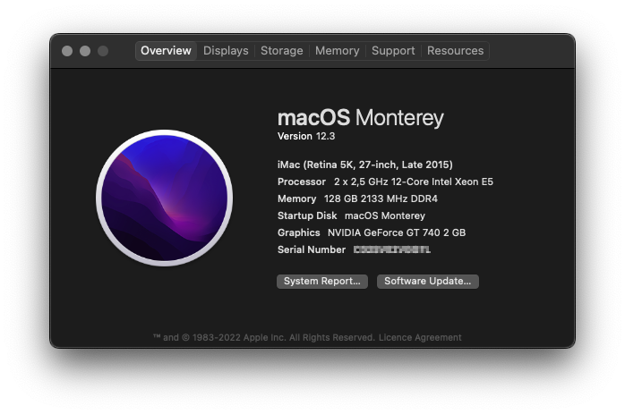
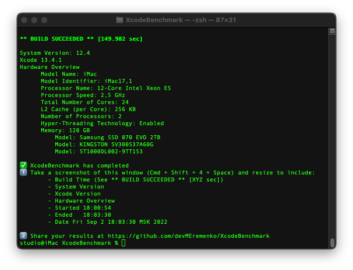
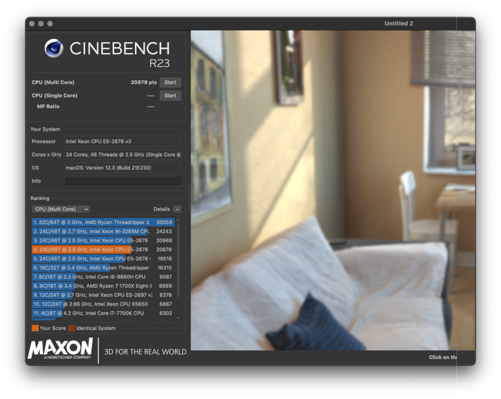
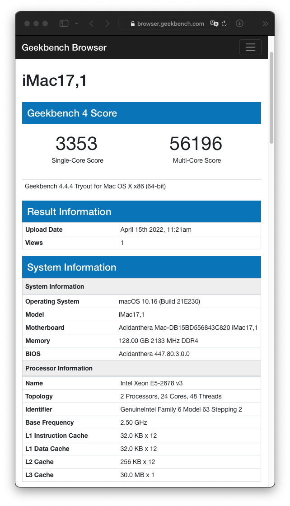
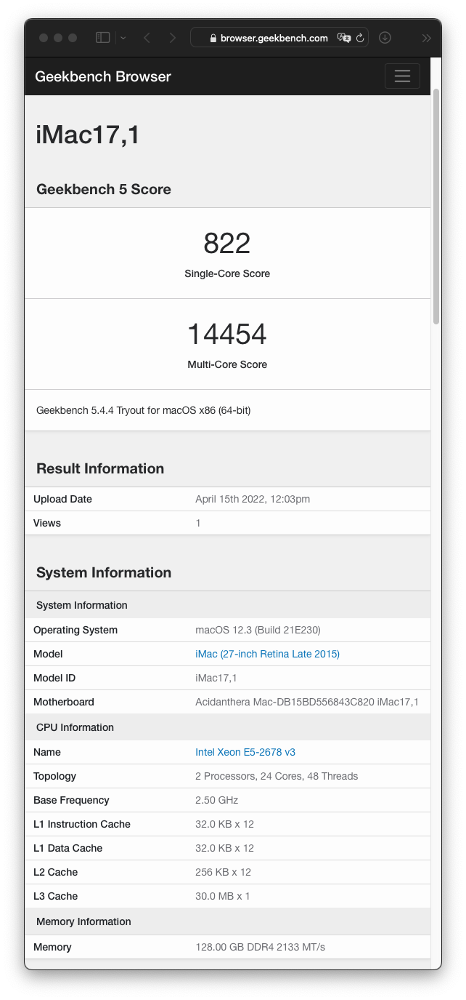

# Huananzhi F8D
**([русская версия](https://github.com/tarkh/hackintosh/blob/main/Huananzhi-F8D/README-rus.md))**

##  `Version for macOS 12 (Monterey)`
<p align="center">
  
</p>

*This version should work with macOS operating systems starting from **10.14 (Mojave)** and ending with **macOS 12 (Monterey)**, however, if you have problems running **macOS < version 12**, you can try an earlier build of the bootloader from the corresponding branch `macOS 10.14 (Mojave)` or `macOS 11 (Big Sur)` in this repository.*

##
* [Introductory Information](#intro)
* [BIOS Setup](#biossetup)
* [macOS Startup](#runmac)
* [macOS Monterey and Nvidia Kepler](#montereyKepler)
* [BIOS Firmware](#wbios)
* [Unlock and undervolting](#unlock)
* [Prebuilt bios with settings, unlock and undervolting](#biosUnlockUndervoltedPrebuilt).
* [For Windows users](#windows)
* [For Linux users](#linux)
* [Removing the USB drive from the system](#removeusb)
* [I'm pro, I don't want to read many letters](#impro)
* [Benchmarks in macOS](#benchmarks)
* [Epilogue](#end)

<a name="intro"></a>
## Introductory information

This repository provides information on installing **macOS** on a system with the following technical characteristics:

* Motherboard: Huananzhi F8D
* Processor: x2 E5-2678V3

**OpenCore (0.8.3)** will be used as an EFI loader, therefore, before starting current process, it is highly recommended to familiarize yourself with this loader and its functionality [here (OpenCore Guide)](https://dortania.github.io/OpenCore-Install-Guide/). In addition to the basic OpenCore setup, a method for unlocking turbo mode on all processor cores and its undervolting will be described. **Windows** users can also use the OpenCore EFI loader to unlock turbo boost and undervolting, which will be discussed in a separate chapter [For Windows users](#windows).

**System memory setup hint**: this motherboard supports **8 channel** DDR4 RAM (x2 CPUs with 4 channel each), so if you utilize all 8 memory slots, this will give you performance boost **up to 15%** comparing to only 4 utilized slots (2 for each CPU).

<a name="biossetup"></a>
## BIOS Setup

If you are not going to flash the BIOS, then you need to make certain changes to the settings of the stock bios. The modified bios from this repository already contains all necessary default settings for the correct launch of macOS.

To get started, go to the bios, reset all settings to default and save with a reboot, then change the following parameters:

* `Advanced > Trusted Computing > Security Device Support` **Disabled**
* `Advanced > ACPI Settings > Enable ACPI Auto Configuration` **Enabled**
* `Advanced > NCT5532D SSIO Configuration > Serial Port 1 Configuration > Serial Port` **Disabled**
* `Advanced > Smart Fan function setting` should be configured depending on your cooling system and processors. In my case, with A500 towers on top of both processors, options are set as follows (quiet and temperature at full load does not exceed 65 degrees):
* `Smart Fan Temperature 1` **30**
* `Smart Fan Temperature 2` **42**
* `Smart Fan Temperature 3` **55**
* `Smart Fan Temperature 4` **67**
* `Smart Fan Critical Temperature` **67**
* `Smart Fan PWM 1` **25**
* `Smart Fan PWM 2` **51**
* `Smart Fan PWM 3` **127**
* `Smart Fan PWM 4` **255**
* `Advanced > Serial Port Console Redirection > Console Redirection` **Disabled**
* `Advanced > PCI Subsystem Settings > Above 4G Decoding` **Enabled**
* `Advanced > Network Stack Configuration > LAN Wake up Control` **Disabled**
* `Advanced > CSM Configuration > CSM Support` **Disabled**. To disable this option, first you need to switch the Video from `Legacy` mode to `UEFI` mode, save the BIOS settings and reboot. Only then it will be possible to set `CSM Support` to the **Disabled** position. At the same time, depending on the video card, when setting the Video parameter from the `Legacy` mode to the `UEFI` mode, it is necessary to put the `Advanced > PCI Subsystem Settings > Above 4G Decoding` parameter in the **Enabled** position, otherwise the video may disappear after reboot and the bios will have to be reset by removing the battery.
* `Advanced > USB Configuration > EHCI Hand-Off` **Enabled**
* `IntelRCSetup > Processor Configuration > MSR Lock Control` **Disable**
* `IntelRCSetup > Advanced Power Management Configuration > CPU C State Control > Package C State limit` **C2 state**
* `IntelRCSetup > Advanced Power Management Configuration > CPU C State Control > CPU C3 report` **Enable**
* `IntelRCSetup > Advanced Power Management Configuration > CPU C State Control > CPU C6 report` **Disable**
* `Security > Secure Boot menu > Secure Boot` **Disabled**

<a name="runmac"></a>
## Launching macOS

To run macOS, we need the `./EFI` directory, which must be copied to the root of the USB drive, previously formatted it in **fat32**. Pay attention, that `./EFI` directory contains `production` version of bootloader. If you need `debug` version with `verbose` mode, please use `./EFI` from `EFI.debug.zip` archive attached.

> If you don't have macOS installed earlier on the internal disk, then you need to create an installation flash drive according to [official OpenCore instructions](https://dortania.github.io/OpenCore-Install-Guide/installer-guide/). When you write down the installation flash drive and get to [this point](https://dortania.github.io/OpenCore-Install-Guide/installer-guide/mac-install.html#setting-up-opencore-s-efi-environment), copy the `./EFI` directory from this repository to the root of the mounted EFI partition.

The EFI directory contains an OpenCore loader pre-configured for this particular system: patched and compiled all the necessary ACPI tables, added the necessary kexts, added support for 24 cores and 48 threads, configured `EFI/OC/config.plist`.

However, before launching, it is necessary to make some mandatory changes to the EFI directory and `EFI/OC/config.plist`. To avoid unexpected errors, open files like `*.plist` in a specialized plist editor! So, what needs to be done:

* Generate and add your own unique serial numbers for the model **iMac17,1**. You will need the [GenSMBIOS utility](https://github.com/corpnewt/GenSMBIOS). The received UUIDs and serial numbers need to be replaced in the file `EFI/OC/config.plist` in the following keys:
* `PlatformInfo > Generic > MLB` we set the generated value `Board Serial`.
* `PlatformInfo > Generic > SystemSerialNumber` we set the generated value `Serial`.
* `PlatformInfo > Generic > SystemUUID` we set the generated value `SmUUID`.
* `PlatformInfo > Generic > ROM` we set the generated value `Rom`.
* If your processor **differs** from E5 2678v3, later on after macOS install it will not be superfluous to reset `CPUFriendDataProvider.kext`, because it made for a specific processor. Detailed information [available here](https://dortania.github.io/OpenCore-Post-Install/universal/pm.html#using-cpu-friend).
* USB ports are configured for a specific motherboard model, the settings are in `EFI/OC/Kexts/USB-Map.kext/Contents/info.plist`. Since macOS limits the number of ports under 15 per 1 controller, I had to leave the front USB 3 port and 2 rear `lower` USB 3 ports only in USB 3 mode without USB 2 support. All other normal USB 2 ports work. Also, the 2 rear `upper` USB 3 operate in two USB 3/USB 2 modes. In addition, I have a discrete PCIe WiFi card with Bluetooth working in native mode. Bluetooth devices in macOS are defined as USB devices and occupy 1 port, but must be marked in a special way for correct operation. In the presented `USB-Map.kext`, such a port is registered relatively to my hardware setup. In your case, the Bluetooth port may be different or the Bluetooth device may not exist at all, so I recommend configuring the `USB-Map.kext/Contents/info.plist` specifically for your setup. Detailed instructions for configuring USB ports [can be found here](https://dortania.github.io/OpenCore-Post-Install/usb/system-preparation.html).
* If you follow these instructions in chronological order and have not yet flashed the BIOS to unlock turbo boost and undervolting, then make sure that the pre-installed efi module `v3x2_80-50-50_39_vcc1.8.efi` is deactivated. To do this, in `EFI/OC/config.plist` in `UEFI > Drivers`, find the entry with the `path` parameter: `v3x2_80-50-50_39_vcc1.8.efi` and make sure that the value of the `Enabled` field is `false`.

Save the configuration file, restart the computer, go to the BIOS and select boot from the UEFI partition of your flash drive. If everything was done correctly, you will see the OpenCore boot menu, where you can choose an internal drive with macOS already installed or the macOS installer in case of a fresh installation.

<a name="montereyKepler"></a>
## macOS Monterey and Nvidia Kepler
Starting from macOS Monterey Apple has removed drivers for Nvidia Kepler from the system. Never the less, there is ways to revert support for this video cards with [Geforce-Kepler-patcher](https://github.com/chris1111/Geforce-Kepler-patcher). Familiarize with it's manual and some limitation, that will occure while using this modification.

<a name="wbios"></a>
## BIOS flashing

In the `./Bios` directory you will find 2 bios files and 2 corresponding bat scripts to run under `AFUDOS` from a special bootable flash drive. You can make such a drive using the `Rufus` program in Windows, having previously completely cleaned the drive and deleted all partitions. More detailed information can be found in `Google`.

This method uses BIOS [HNX99F8D_200624_kot_v002](https://github.com/Koshak1013/HuananzhiX99_BIOS_mods/tree/master/Huananzhi%20X99-F8D/2020-06-24) from the wonderful repository of [Koshak1013](https://github.com/Koshak1013). This bios contains a number of fixes, microcode updates, BCLK 100.00MHz, access to memory timings settings and unlocked ME-regions so that you can later flash bioses without a programmer. **The guys are doing a great job, and the repository is constantly being updated with new bioses for various motherboards from China, so do not hesitate to go to their repository and make a donation!**

So, in the directory `./Bios` there are the following bioses:

* **f8dKS.bin**, where:
* **K** is the original bios from [Koshak1013](https://github.com/Koshak1013 ) (`HNX99F8D_200624_kot_v002`).
* **S** - all bios settings alredy builted in for correct operation in macOS (from [BIOS Setup](#biossetup)).
* **f8dKSM.bin**, where:
* **K** and **S** from the previous paragraph.
* **M** - the microcode `6F 06F2` has been removed for the possibility of subsequent turbo boost unblocking via efi modules.

If there is a stock bios in your motherboard, then the ME-regions are locked in it. Nevertheless, there are 2 ways to flash the modified bios...

> **As usual, you perform all operations with bios firmware at your own risk, with full understanding that it is simply necessary to have a programmer to be able to restore the "bricked" board.**

#### Method 1 (correct)

Use the programmer `CH341A` with a test clip. In this case, there is no need to solder out the bios, it is enough to put on the test clip correctly, remove the battery from the motherboard, and leave the PSU connected to the power with the latch turned on. You can `Google` a lot of materials on doing this process on Windows machine.

I would like to describe an alternative way of flashing the bios through a programmer from under macOS or Linux. To do this, we need the command-line utility [flashrom](https://flashrom.org/Flashrom). In my opinion, working with it is much easier than using a GUI application in Windows. On macOS, this utility can be [installed via Homebrew](https://brewinstall.org/install-flashrom-on-mac-with-brew/). After installation, the `flashrom` command becomes available in the Terminal ([read man](https://linux.die.net/man/8/flashrom)). Afret connecting the programmer correctly we can make a dump of the current bios:

`sudo flashrom --programmer ch341a_spi -r backup.bin`

Then we flash our modified bios. If you want to unlock the turbo boost, we flash `f8dKSM.bin`, if not, then `f8dKS.bin`:

`sudo flashrom --programmer ch341a_spi -w f8dKSM.bin`

Flashrom will automatically dump bios into memory, clear the bios, flash a new one, read it and compare it with the dump. In general, everything is quite simple.

#### Method 2

Despite the fact that the stock bios has a lock on the ME-regions, it is still possible to flash over the modified one using the `Afudos` program from a bootable USB drive. The bios will be flashed, but not completely, leaving the locked ME-regions. This method of flashing was also tested by me personally, the turbo boost unlock and the memory timings menu work. Nevertheless, **I highly recommend getting a programmer and flashing the modified bios correctly 1 time, all subsequent flashing can be done without a programmer, since everything will be unlocked**.

#### Post-flashing

After flashing the bios from this repository, there is no need to pull the battery out of the motherboard and reset the settings to default - everything is already configured for macOS to work correctly. When bios flashing is completed, turn off the computer, wait 10 seconds and turn it back on. You can boot into macOS.

<a name="unlock"></a>
## Unlock and undervolting

All cores Turbo boost unlock and undervolting will be done by means of efi modules from the user [MOF from the forum AnandTech](https://forums.anandtech.com/threads/what-controls-turbo-core-in-xeons.2496647/page-112#post-39875881). This method is quite simple and there is no need to flash the bios every time to make adjustments. There are some downsides to this method:
* An EFI bootloader is required (in our case, this is not a downside, since we use OpenCore anyway).
* Efi modules contain an average grid of values for undervolting, completely custom values can be set only by assembling your Efi module, or by flashing parameters directly into the bios.

If you need simplicity and flexibility, keep reading. If you want to hardcore the settings as accurately as possible for your processors, squeezing every millivolt out of them, go to the repository of [Koshak1013](https://github.com/Koshak1013/HuananzhiX99_BIOS_mods#Instructions-for-unlocking-the-maximum-frequency-for-all-cores-not-two-unlock), there is a detailed description of the method for selecting limit values, assembling the driver and flashing thereof directly into the bios. Also you can test [prebuilt bios with settings, unlock and undervolting](#biosUnlockUndervoltedPrebuilt).

So, in order to unlock and undervolt the processor, you need to load the efi driver responsible for this into the bios. As I wrote above, this repository contains drivers from `MOF`, since they personally showed the best result for me. In the `./mmof` directory you will find many files with different settings recorded in them, the values of which are displayed in the file names themselves. For example, lets look at preinstalled into OpenCore EFI driver `v3x2_80-50-50_39_vcc1.8.efi`, from it's name we can see:

* -80mV core.
* -50mV cache.
* -50mV system agent.
* 1.8V vccin.
* Powercut + ucode39.

The values may differ for your specific processors, since crystals in processors of the same model may differ in their properties. Silicon lottery, so to speak.

Installation of the necessary driver in the OpenCore EFI loader takes place in 2 steps:

* The required efi module from the directory `./mmof` must be copied to the USB drive in `/EFI/OC/Drivers/`
* Open the config `EFI/OC/config.plist` in a specialized `*.plist` editor and go to the key `UEFI > Drivers`, there find an entry with the parameter `path`: `v3x2_80-50-50_39_vcc1.8.efi`, change the name of efi file to the one you've copied a5nd change value of the field `Enabled` from `false` to `true`.

Save the config and **turn off** (do not restart) the computer. After 10 seconds, turn it back on and select booting from the UEFI partition of the USB drive in the bios.

Immediately after that, we should see the American Megatrends screensaver, under which the following text should appear:

```
Package 00: Core x33: UnCore: x30 Done!
Package 01: Core x33: UnCore: x30 Done!
uCode ver 0x39: *************************************************
Done!
```

This will mean that our efi module has been successfully loaded. Next, your task is to properly test the operation of the processor in different types of loads. Read more about this in the repository of [Koshak1013](https://github.com/Koshak1013).

<a name="biosUnlockUndervoltedPrebuilt"></a>
## Prebuilt bios with settings, unlock and undervolting

There is a prebuilt bios with all settings, turbo unlock, undervolting and other things already flashed inside. You can find it in `./Bios` directory under the name `f8dKSM708050V1700FTU2929.bin`. It has upper-medium settings:

* -70mV core.
* -80mV cache.
* -50mV system agent.
* 1.7V vccin.
* Powercut + ucode39.
* Uncore 2929.

<a name="windows"></a>
## For Windows users

This repository is primarily intended for Hackintosh adherents, but the OpenCore EFI loader we use is configured and fully ready to work with Windows OS, both in dual-boot mode with macOS and without it.

>**The main requirement for Windows is that the operating system must be installed only in UEFI mode!**

To start, we need to flash the bios (chapter [BIOS Firmware](#wbios)), make a USB drive (the beginning of the chapter [macOS Startup](#runmac)) and put the necessary efi driver in OpenCore (chapter [Unlock and undervolting](#unlock)).

Turn off the computer, wait 10 seconds, launch it and select the UEFI partition of our USB drive in the bios. The OpenCore boot menu should appear, where you can select the OS you need to boot. If nothing is selected, then after 5 seconds OpenCore will load the first OS in the list automatically. More fine-tuning of the loader menu can be done later by studying [OpenCore features](https://dortania.github.io/OpenCore-Install-Guide/).

<a name="linux"></a>
## For Linux users

For Linux users everything is the same as [For Windows users](#windows).

<a name="removeusb"></a>
## Removing the USB drive from the system

After the perfect efi driver is found and you are **happy**, we are ready to get rid of a bootable USB flash drive in the USB connector of the computer. To do this, we need to mount the EFI partition of the internal disk and move the EFI directory from the root of our USB drive to its root. If we use macOS, it is advised to mount the EFI partition on the same media where the OS is located. This is also true for any other operating systems. In the case of multi-OS boot, it is enough to place OpenCore on one of the disks with OS and set it first in the queue for loading in the bios.

You can find out how to mount EFI partitions in different operating systems in `Google`. Here is a good and pretty short guide for [macOS/Linux/Windows](https://noobsplanet.com/index.php?threads/how-to-mount-efi-partition-from-windows-linux-or-mac.56/).

<a name="impro"></a>
## I'm pro, I don't want to read many letters

OK, then it's simple:

* Flash bios from `./Bios`. **f8dKS.bin** - without the turbo-boost unlock, but with embedded settings for macOS (Linux and Windows also work). **f8dKSM.bin** - the same + microcode `6F 06F2` removed.
* Format the flash drive in **fat32**, drop the `./EFI` directory into the root of USB stick.
* Alter `EFI/OC/config.plist` with your generated serial numbers for **iMac17,1**. If macOS is not needed, you can skip it.
* Put necessary efi module from `./mmof` into `EFI/OC/Drivers` and set corresponding file name in `EFI/OC/config.plist`, in the key `UEFI > Drivers` and enable it.
* Save, turn off, wait, turn on, boot from the flash drive - win-win.

<a name="benchmarks"></a>
## Benchmarks in macOS

<table width="100%">
  <tr>
    <td align="center" valign="top" colspan="2">
      XcodeBenchmark (<a href="https://github.com/devMEremenko/XcodeBenchmark#xcode-130-or-above">compare to Mac results</a>)<br>
      
    </td>
  </tr>
  <tr>
    <td align="center" valign="top" colspan="2">
      Cinebench R23<br>
      
    </td>
  </tr>
  <tr>
    <td align="center" valign="top">
      Geekbench 4<br>
      
    </td>
    <td align="center" valign="top">
      Geekbench 5<br>
      
    </td>
  </tr>
</table>

<a name="end"></a>
## Epilogue

Regarding macOS, I got a fully working stable system. PowerManagement works well, even without the turbo boost unlock, the system gives good results in benchmarks. On average, 10-15% less than with Turbo unlock, i.e. the difference is not huge.

>**Sleep doesn't work, but this problem comes from the macOS kernel itself, since there are no two-socket solutions in modern Apple computers. Perhaps someone will solve this problem someday. If you will find out solution, please let me know.**

I will be glad to receive feedback in order to improve this configuration. You can find me on telegram:
* [@tarkhx](https://t.me/tarkhx)
* [Telegram group on LGA2011 and XEON](https://t.me/Chinese_lga2011_3_x99)
